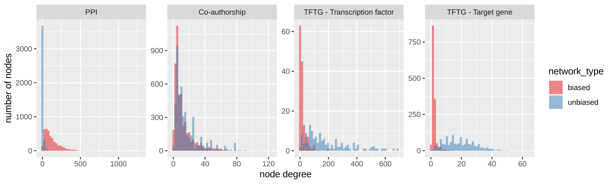
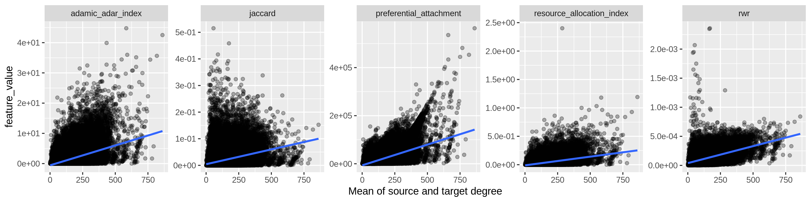

`Ignore poor phrasing, this is just to get the ideas out. Rephrasing can be done later`

## Abstract

Node degree can strongly influence many network-based inference methods like clustering, link prediction, and node ranking.
In fact, some methods produce features that are so strongly influenced by degree that their performance in their intended applications is indistinguishable from features derived exclusively from node degree.
Some inference methods intend to rely on node degree, while other methods are confounded by it.
We use degree-preserving network randomization to build a framework for considering the effects (whether intended or unintended) of node degree on network link-prediction methods.

`Above paragraph should include a mention of the degree bias in data themselves.`

The method we propose is generalizable to many network prediction and inference tasks.
A feature-extraction method can be applied to a network, and its performance can be compared to a `?meaningful?` counterfactual distribution via permuted networks.
The application of methods both to real and to permuted networks allows one to quantify the method's performance that is attributable to the effect of degree alone.

We find that constructed features that take the counterfactual condition into account can be decorrelated with node degree `Figure 2?`, allowing predictive performance on new datasets to be improved `Figure 3?` and predictions to be less biased. `Could quantify "bias" as dissimilarity to unbiased??`
In particular, when translating a predictive method from a biased degree network to making predictions on a network without degree bias, performance is increased. `- rephrase!`

## Background

```
1. Biomedical networks often have very biased node degree.
(Should ideally show more than one network here)
2. Prediction methods are known to pick up on node degree.
(Need to show, at minimum, all `networkx` link prediction metrics.
The more methods the better.)
3. The actual goal is to make predictions that look like they would
come from an unbiased network.
"Or just, make predictions that are not biased by degree"?

That is, while more edges exist between high-degree nodes, we want to
make predictions in a more unbiased way. At least if the goal is, in fact,
to make unbiased predictions. Could do a quick play through of this, that
it is easier to make biased predictions, but no reason to think we should
prefer those, because they will be disproportionately between high degree
nodes.

Therefore, it makes sense to correct for node degree in our features.
```

### Node degree bias

Networks of biomedical data often have node degrees that are biased with respect to the extent to which certain things have been studied.
Such bias has been shown to be especially pronounced when networks are constructed using data extracted from the literature. `Citation needed`.
As the extent to which a biomedical entity has been studied does not necessarily imply its number of true connections.
Therefore, less well-studied entities will have degrees that are biased toward being significantly lower than their true number of connections, when compared to better-studied entities.

This phenomenon can be demonstrated in domains where unbiased experimentation methods exist, for example high-throughput, hypothesis-free experimentation.
In such domains, it is possible to quantify the degree bias in literature-derived networks by comparing such networks to networks producted via unbiased experimentation.
Assuming that the biases of high-throughput experimentation are roughly degree-independent, one can assume that the degree distributions of unbiased networks resemble the degree distributions of true relationships.

Figure {@fig:node-degree-bias} shows the phenomenon of node degree bias in four networks, two protein-protein interaction networks, one of which is literature-derived, and the other of which was constructed via a high-throughput screen of all human proteins, and two transcription factor-target gene networks, one of which is literature-derived, and the other of which was constructed from a ChIP-seq screen.

{#fig:node-degree-bias width="100%}

`Figure 1 caption should give citations of networks`

Unbiased experimental methods give relationship networks whose degree distributions are similar to the distribution of degrees for true relationships.
Many domains, however, do not have unbiased experimental methods, either because such methods have not yet been developed or because such methods are not possible, in principle.
For example, compound-disease treatment relationships in human patients can not be elucidated via large scale, unbiased experimentation.
Without unbiased data, the available networks on which inference methods can be applied (the data themselves) have node degree bias of an unquantifyable magnitude.
It is therefore helpful to use methods that can quantify and correct for the effects of degree on the methods used for network inference
`its not just inference, really. Maybe not even inference at all...`.

### Feature-degree correlation

```
Say that we are going to restrict our attention to the example of link prediction.
Though other types of network methods could be applicable, eg. clustering, node ranking, etc.
Brief overview of these prediction methods.
Note, these are not the features that we are looking at on permuted networks, so its not totally clear that we should be showing these here.
At least, say that many features are *clearly* correlated with degree.
We are going to restrict our attention to RWR and Jaccard.
Should add RWR to the graph.
Might be helpful to further reduce alpha.
```

Network analysis methods are varied and can examine networks at varying scales, including node, node-pair, community, and whole-network.
For the purposes of this discussion, we will restrict our attention to node-pair features used for purposes of link prediction, though the principles are also applicable to other types of network analyses.


{#fig:features-degree width="100%"}

### Network permutation

```
Need a discussion about what counterfactual would look like.
Wouldn't expect zero features in "null condition".
Should explain what the "null condition" should be, logically, and why permutations capture that.
```

To quantify the effects of node degree on network-based methods, we propose a comparison between the network of actual data and degree-preserving permutations of that network.
By applying a network-based method to both the true network and its permutations, one can isolate the connectivity of the true network from the network's degree sequence and thereby quantify the effect of node degree on predictive/inference methods.

The specifics of this comparison depend on the specific predictive or inference task being performed.
We use link prediction as an example application that illustrates several of the ways in which network permutation can be useful.

## Methods

### XSwap algorithm


## Results


<!-- For applications where node degree can be an unwanted source of bias, we present a simple nonparametric framework that accounts for node degree through degree-preserving network randomizations and finds the probability that observed features would occur due only to node degree and global network structure.

For link-prediction applications where node degree is an intended feature, we present the "edge prior", an estimate of the probability that a specific edge exists in random networks with a given degree sequence.

The null hypothesis which underlies the edge prior is, if the edges in this network are meaningless, what is the probability that you would observe an edge here? So the actual null hypothesis is that the specific conections in this network do not represent information that is useful for predicting edges. Though, it really isn't a hypothesis test we are doing. Maybe, "

-->

<!--
Interlude:

But it's not that a network is a random draw from a distribution of a given degree sequence, but that each edge really is independent, and exists with its own probability. The degree sequence is just a realization. Maybe think about each source node as having a degree that is drawn from a binomial distribution with node-unique parameter \theta_i, but common N = number of source nodes. Then the actual edges are

How performance varies depends on so many factors. Some features will have p > feat while others have vice versa. Also depends on the data, as sometimes edge priors are really predictive, while other times they are not. When edge prior does really well, could that mean we are closer to the real degree distribution? So that moving around existing edges produces plausible realizations of the actual network?

So what about the differences between data? Perhaps the two are actually one and the same, and it is simpler still. That is, the whole point is that we are presenting a method for quantifying the """percent of performance???""" really needs a serious treatment> that is due to degree alone.

What metric could that be? (AUROC - P-AUROC) / (AUROC)? The fraction of AUROC that is due to degree (really global degree sequence) alone. Which makes more sense, because AUROC depends both on feature and data. And that's the benefit of this, you can quantify the extent to which data is due to degree. Moreover, its super general, because it doesn't even depend on AUROC. It can be AUPR, accuracy, F1, whatever. Probably should do one of those.

 -->

<!--
    Why would we need to randomize networks?
    * How can we contextualize this approach? Like "Monte Carlo"? Or more like a permutation test?
-->

<!--
    Why should degree be preserved?
    * Need to show that degree is a massive confounder
    * Citations would be helpful here, but maybe scant empirical proof
        * How do you even prove something is a "confounder"?
-->

<!-- Other methods to get similar results? Chung-Lu, "configuration model"? etc. -->

<!--
    XSwap algorithm
    * Background -> Original paper
-->

## Methods

<!--
    XSwap algorithm
    * Modifications we made to the original method... if any?
    * Pseudocode
-->

<!--
    Implementation (fairly brief)
    * Why Python
    * Why C++
    * Brief architecture discussion
-->

<!--
    Comparisons
    * XSwap-randomization vs other kinds of background performance metrics
    * Other graphs
    * Other predictive tasks/implementations
-->

## Results

<!-- Performance of XSwap itself -->
<!-- x: Number of attempts, y: Number of successful swaps -->
<!-- x: Number of attempts, y: Percent of edges unchanged -->
<!-- Network density vs (fractional) attempts to 50% (or some cutoff) changed -->
<!-- Is it possible to estimate the fraction of the random graph space that is being explored by XSwap? -->
<!-- Is there a closed-form solution for the probability of an edge after a certain number of swaps? -->

<!-- Comparisons of other methods through the use of XSwap -->

## Discussion

