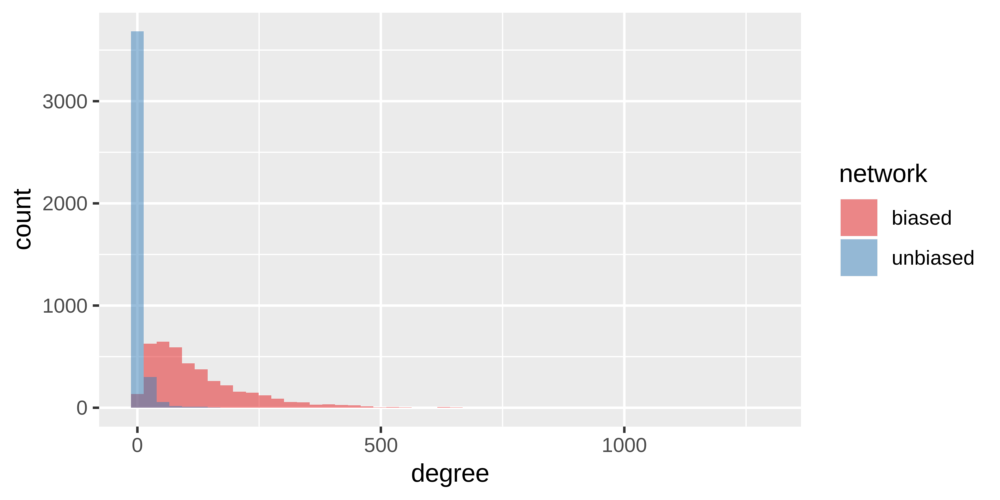

## Abstract

Node degree can strongly influence many network-based inference methods like clustering, link prediction, and node ranking.
In fact, some methods produce features that are so strongly influenced by degree that their performance in their intended applications is indistinguishable from features derived exclusively from node degree.
Some inference methods intend to rely on node degree, while other methods are confounded by it.
We use degree-preserving network randomization to build a framework for considering the effects (whether intended or unintended) of node degree on network link-prediction methods.

A particular strength of the proposed method is its generalizability.
Any feature-extraction method that could be applied to a network can be compared to a <?meaningful?> counterfactual distribution.
Specifically, computing network inference features <or, "applying network inference methods"> on randomized networks created through degree-preserving permutations allows one to quantify the method performance that is attributable to the effect of degree alone.

We find that taking account of method performance beyond the counterfactual condition can allow features to become decorrelated with node degree <Figure 2?>, allowing predictive performance on new datasets to be improved <Figure 3?>.
In particular, when translating a predictive method from a biased degree network to making predictions on a network without degree bias, performance is increased. <<- rephrase!>

## Background

<Ignore poor phrasing, this is just to get the ideas out. Rephrasing can be done later>

### Node degree bias

Networks of biomedical data often have node degrees that are biased with respect to the extent to which certain things have been studied.
It has been shown that literature-derived networks of biological and biomedical entities have a large bias toward well-studied entities <Citation needed>.
This phenomenon can be demonstrated in domains where unbiased experimentation methods exist, for example high-throughput, hypothesis-free experimentation.
In such domains, it makes sense to consider the extent to which the network's node degree sequence is biased with respect to the true biological or biomedical relationships.

A common type of network that is often subject to degree bias are literature-derived biomedical networks.
Often these data are extracted from literature describing smaller-scale, hypothesis-driven scientific experiments.
Literature-derived networks can be contrasted with networks produced through unbiased experimentation to show that node degree is not necessarily reflective of true biological relationships. <Not true. Not saying the connections are false, but that the relative degree is not reflective a true relative difference in number of relationships.>
Well-studied entities will have many connections in literature-derived networks, while less well-studied entities, which may also have a high number of true connections, will not have a high degree.
Figure {@fig:node-degree-bias} shows the phenomenon of node degree bias in two protein-protein interaction networks, one of which is literature-derived, and the other of which was constructed via a high-throughput screen of all human proteins.
The figure shows

{#fig:node-degree-bias height="300px"}

<Figure 1 should be changed such that "count" becomes something like "number of nodes", and "network" actually gives the source of the networks, so like "Rolland, 2014" or whatever.>

Many domains, such as the study of human drug efficacy compound-disease treatment relationships> or pick something that is network-based and realistically something to which we could be applying this method>, do not yet have equivalently unbiased methods for experimentation.
Without unbiased data, the available networks on which inference methods can be applied (the data themselves) have node degree bias of an unquantifyable magnitude.
It is therefore helpful to use methods that can quantify and correct for the effects of degree on the methods used for network inference its not just inference, really. Maybe not even inference at all...>.

### Network permutation

To quantify the effects of node degree on network-based methods, we propose a comparison between the network of actual data and degree-preserving permutations of that network.
By applying a network-based method to both the true network and its permutations, one can isolate the connectivity of the true network from the network's degree sequence and thereby quantify the effect of node degree on predictive/inference methods.

The specifics of this comparison depend on the specific predictive or inference task being performed.
We use link prediction as an example application that illustrates several of the ways in which network permutation can be useful.

## Methods

### XSwap algorithm

## Results

<!-- For applications where node degree can be an unwanted source of bias, we present a simple nonparametric framework that accounts for node degree through degree-preserving network randomizations and finds the probability that observed features would occur due only to node degree and global network structure.

For link-prediction applications where node degree is an intended feature, we present the "edge prior", an estimate of the probability that a specific edge exists in random networks with a given degree sequence.

The null hypothesis which underlies the edge prior is, if the edges in this network are meaningless, what is the probability that you would observe an edge here? So the actual null hypothesis is that the specific conections in this network do not represent information that is useful for predicting edges. Though, it really isn't a hypothesis test we are doing. Maybe, "

-->

<!--
Interlude:

But it's not that a network is a random draw from a distribution of a given degree sequence, but that each edge really is independent, and exists with its own probability. The degree sequence is just a realization. Maybe think about each source node as having a degree that is drawn from a binomial distribution with node-unique parameter \theta_i, but common N = number of source nodes. Then the actual edges are

How performance varies depends on so many factors. Some features will have p > feat while others have vice versa. Also depends on the data, as sometimes edge priors are really predictive, while other times they are not. When edge prior does really well, could that mean we are closer to the real degree distribution? So that moving around existing edges produces plausible realizations of the actual network?

So what about the differences between data? Perhaps the two are actually one and the same, and it is simpler still. That is, the whole point is that we are presenting a method for quantifying the """percent of performance???""" really needs a serious treatment> that is due to degree alone.

What metric could that be? (AUROC - P-AUROC) / (AUROC)? The fraction of AUROC that is due to degree (really global degree sequence) alone. Which makes more sense, because AUROC depends both on feature and data. And that's the benefit of this, you can quantify the extent to which data is due to degree. Moreover, its super general, because it doesn't even depend on AUROC. It can be AUPR, accuracy, F1, whatever. Probably should do one of those.

 -->

<!--
    Why would we need to randomize networks?
    * How can we contextualize this approach? Like "Monte Carlo"? Or more like a permutation test?
-->

<!--
    Why should degree be preserved?
    * Need to show that degree is a massive confounder
    * Citations would be helpful here, but maybe scant empirical proof
        * How do you even prove something is a "confounder"?
-->

<!-- Other methods to get similar results? Chung-Lu, "configuration model"? etc. -->

<!--
    XSwap algorithm
    * Background -> Original paper
-->

## Methods

<!--
    XSwap algorithm
    * Modifications we made to the original method... if any?
    * Pseudocode
-->

<!--
    Implementation (fairly brief)
    * Why Python
    * Why C++
    * Brief architecture discussion
-->

<!--
    Comparisons
    * XSwap-randomization vs other kinds of background performance metrics
    * Other graphs
    * Other predictive tasks/implementations
-->

## Results

<!-- Performance of XSwap itself -->
<!-- x: Number of attempts, y: Number of successful swaps -->
<!-- x: Number of attempts, y: Percent of edges unchanged -->
<!-- Network density vs (fractional) attempts to 50% (or some cutoff) changed -->
<!-- Is it possible to estimate the fraction of the random graph space that is being explored by XSwap? -->
<!-- Is there a closed-form solution for the probability of an edge after a certain number of swaps? -->

<!-- Comparisons of other methods through the use of XSwap -->

## Discussion

