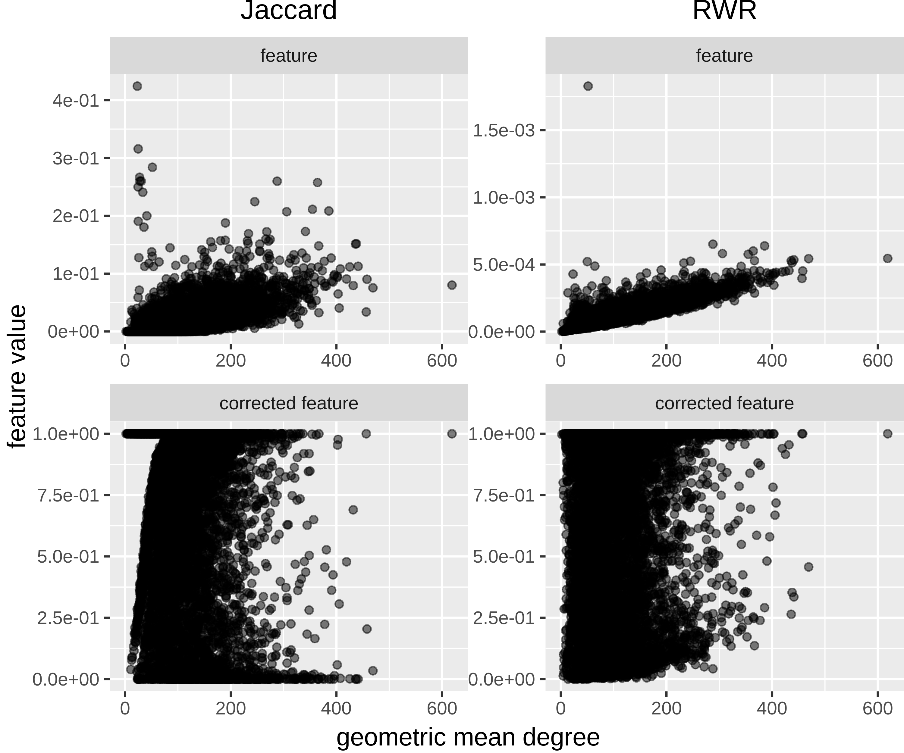
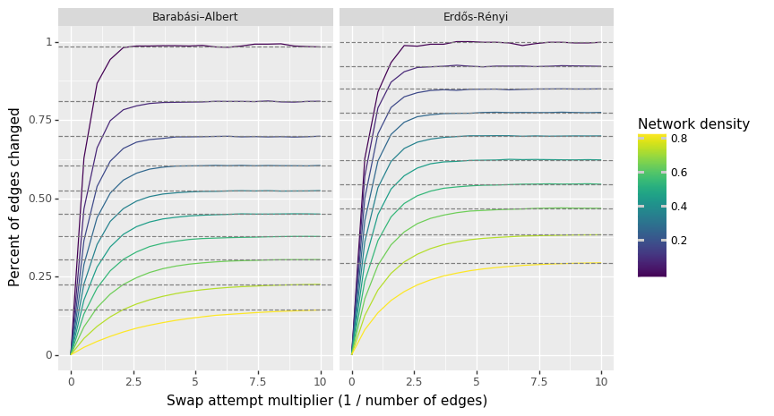

`Ignore poor phrasing, this is just to get the ideas out. Rephrasing can be done later`

Node degree can strongly influence many network-based inference methods like clustering, link prediction, and node ranking.
In fact, some methods produce features that are so strongly influenced by degree that their performance in their intended applications is indistinguishable from features derived exclusively from node degree.
Some inference methods intend to rely on node degree, while other methods are confounded by it.
We use degree-preserving network randomization to build a framework for considering the effects (whether intended or unintended) of node degree on network link-prediction methods.

`Above paragraph should include a mention of the degree bias in data themselves.`

The method we propose is generalizable to many network prediction and inference tasks.
A feature-extraction method can be applied to a network, and its performance can be compared to a `?meaningful?` counterfactual distribution via permuted networks.
The application of methods both to real and to permuted networks allows one to quantify the method's performance that is attributable to the effect of degree alone.

We find that constructed features that take the counterfactual condition into account can be decorrelated with node degree `Figure 2?`, allowing predictive performance on new datasets to be improved `Figure 3?` and predictions to be less biased. `Could quantify "bias" as dissimilarity to unbiased??`
In particular, when translating a predictive method from a biased degree network to making predictions on a network without degree bias, performance is increased. `- rephrase!`

## Background

```
1. Biomedical networks often have very biased node degree.
(Should ideally show more than one network here)
2. Prediction methods are known to pick up on node degree.
(Need to show, at minimum, all `networkx` link prediction metrics.
The more methods the better.)
3. The actual goal is to make predictions that look like they would
come from an unbiased network.
"Or just, make predictions that are not biased by degree"?

That is, while more edges exist between high-degree nodes, we want to
make predictions in a more unbiased way. At least if the goal is, in fact,
to make unbiased predictions. Could do a quick play through of this, that
it is easier to make biased predictions, but no reason to think we should
prefer those, because they will be disproportionately between high degree
nodes.

Therefore, it makes sense to correct for node degree in our features.
```

### Node degree bias

Networks of biomedical data often have node degrees that are biased with respect to the extent to which certain things have been studied.
Such bias has been shown to be especially pronounced when networks are constructed using data extracted from the literature. `Citation needed`.
As the extent to which a biomedical entity has been studied does not necessarily imply its number of true connections.
Therefore, less well-studied entities will have degrees that are biased toward being significantly lower than their true number of connections, when compared to better-studied entities.

This phenomenon can be demonstrated in domains where unbiased experimentation methods exist, for example high-throughput, hypothesis-free experimentation.
In such domains, it is possible to quantify the degree bias in literature-derived networks by comparing such networks to networks producted via unbiased experimentation.
Assuming that the biases of high-throughput experimentation are roughly degree-independent, one can assume that the degree distributions of unbiased networks resemble the degree distributions of true relationships.

Figure {@fig:node-degree-bias} shows the phenomenon of node degree bias in four networks, two protein-protein interaction networks, one of which is literature-derived, and the other of which was constructed via a high-throughput screen of all human proteins, and two transcription factor-target gene networks, one of which is literature-derived, and the other of which was constructed from a ChIP-seq screen.

![Degree distributions of biased and unbiased networks are very different, though not consistently. Protein-protein interaction (PPI) literature-derived network from STRING (Szklarczyk et al.) [@doi:10.1093/nar/gky1131], high-throughput-derived networks from Rual et al. [@doi:10.1038/nature04209] and Rolland et al. [@doi:10.1016/j.cell.2014.10.050]. Transcription factor-target gene (TFTG) literature-derived network from Han et al. [@doi:10.1093/nar/gkx1013] and high-throughput network from Lachmann et al. [@doi:10.1093/bioinformatics/btq466]. `Should have "literature-derived", and "high-throughput" or "hypothesis-free" rather than "biased" and "unbiased".`](images/degree_dists.png){#fig:node-degree-bias width="100%}

Unbiased experimental methods give relationship networks whose degree distributions are similar to the distribution of degrees for true relationships.
Many domains, however, do not have unbiased experimental methods, either because such methods have not yet been developed or because such methods are not possible, in principle.
For example, compound-disease treatment relationships in human patients can not be elucidated via large scale, unbiased experimentation.
Without unbiased data, the available networks on which inference methods can be applied (the data themselves) have node degree bias of an unquantifyable magnitude.
It is therefore helpful to use methods that can quantify and correct for the effects of degree on the methods used for network inference
`"Inference" is probably not a fully appropriate way of putting it.`

### Feature-degree correlation

```
Say that we are going to restrict our attention to the example of link prediction.
Though other types of network methods could be applicable, eg. clustering, node
ranking, etc. Brief overview of these prediction methods.
Note, these are not the features that we are looking at on permuted networks,
so its not totally clear that we should be showing these here.
At least, say that many features are *clearly* correlated with degree.
We are going to restrict our attention to RWR and Jaccard.
Should add RWR to the graph.
Might be helpful to further reduce alpha.

What might also be nice is a more direct visualization of how those edges
that you wouldn't otherwise have predicted degrees look. Some way to connect
the different degree histograms to the feature degree correlations. I guess
this may actually be the ROC curves.
```

Network analysis methods are varied and can examine networks at varying scales, including node, node-pair, community, and whole-network.
For the purposes of this discussion, we will restrict our attention to node-pair features used for purposes of link prediction, though the principles are also applicable to other types of network analyses.

As shown in Figure {@fig:node-degree-bias}, bias in degree distribution can be toward either higher or lower degree.
To make unbiased predictions, therefore, features used for prediction should not be strongly influenced by degree, either positively or negatively.
Figure {@fig:features-degree} shows five features commonly used for link prediction and the varying extents to which they are correlated with degree.
All five features show a positive relationship with degree, though the magnitude of this correlation is highly variable.
For example, preferential attachment and random walk with restart (RWR) appear to have stronger relationships with degree than the resource allocation index.

![Correlation of link-prediction features with node degree in the literature-derived protein-protein interaction network [@doi:10.1093/nar/gky1131] `Should make headers formatted strings, not including underscores.`](images/link_prediction_features_degree_horizontal.png){#fig:features-degree width="100%"}

While the equations that define some features can allow one to predict the effect degree would have, it is preferable to have a more general meta-analysis method for comparing the relative effects of node degree, especially in light of the progress that has been made toward link prediction (and other network analysis methods) that are harder to explain, like deep learning approaches.

### Network permutation

```
Need a discussion about what counterfactual would look like.
Wouldn't expect zero features in "null condition".
Should explain what the "null condition" should be, logically, and why
permutations capture that.

I think this background section should not focus on network permutation per se,
but on comparing features with meaningful counterfactuals rather than other
features. Then methods (or discussion) should justify permutation vs other
methods for generating random networks.
```

Features computed from data networks for the purposes of analysis or prediction are not as comparable to one another as one might expect.
In particular, the values of a single feature for various network entities (whether nodes, node pairs, communities, etc.) are not, in general, meaningfully comparable to one another.
The raw values of features computed for a given network entity depend both on relevant and extraneous information, including extraneous structural properties of the network.
For this reason, the strength of signal for an entity from a feature should be obtained not by comparing entities to other entities, but by comparing feature values for a single entity with itself, computed on networks that isolate the extraneous structural information.

Comparing entities by a feature is not particularly helpful because the extent to which a feature would not be expected at random is not equivalent to the rank-ordering of feature values themselves.
For example, node pair A may have a higher feature value than node pair B, but if node pair B's value is far less likely to occur simply due to extraneous structural properties of the network, then node pair B could be a more interesting signal than node pair A, despite its higher raw feature value.

Put differently, we propose comparing entities not by their feature scores themselves, but by features corrected for extraneous information through the use of meaningful counterfactual distributions. To quantify the effects of degree on network-based methods, we propose a comparison between a network of actual data and degree-preserving permutations of the network.
By comparing a network-based method between the true network and its permutations, one can isolate the network's degree sequence and thereby quantify the effect of degree on predictive/inference methods.

The specifics of this comparison depend on the specific predictive or inference task being performed.
We use link prediction as an example application that illustrates several of the ways in which network permutation can be useful.
For the purposes of demonstration, we will focus our attention on two features: RWR, that appears to be correlated with degree, and the Jaccard coefficient, that does not appear to be as strongly correlated with degree (Figure {@fig:features-degree}).

## Methods

<!--
    XSwap algorithm
    * Background -> Original paper
    * Modifications we made to the original method... if any?
    * Pseudocode
-->

<!--
    Implementation (fairly brief)
    * Python, C++
    * Brief architecture discussion?
-->

<!--
    Comparisons - more appropriate for discussion.
    * XSwap-randomization vs other kinds of background performance metrics
    * Other graphs
    * Other predictive tasks/implementations
-->

### XSwap algorithm

Hanhijärvi, et al. presented XSwap [@doi:10.1137/1.9781611972795.67], an algorithm for the randomization ("permutation") of unweighted networks (Figure {@fig:algo}A).
The algorithm picks two existing edges at random, and if the edges constitute a valid swap, exchanges the targets between the edges.
To allow greater flexibility for heterogeneous biomedical networks with various types of relationships, we added two option parameters, "`allow_self_loops`", and "`allow_antiparallel`" that allow a greater range of possibly valid swaps (Figure {@fig:algo}B).
Specifically, two chosen edges constitute a valid swap if they preserve degree for all four involved nodes and do not violate the above condition options.
The motivations for these generalizations are to make the permutation method applicable to both directed and undirected graphs, as well as between networks with different types of nodes, variously called multipartite, heterogeneous, or multimodal networks.
The original algorithm and our proposed modification are shown below.

![**A.** XSwap algorithm due to Hanhijärvi, et al. [@doi:10.1137/1.9781611972795.67]. **B.** Proposed modification to XSwap algorithm](images/algos-merged.png){#fig:algo width="100%"}

### Data used for comparisons

We used three different types of biomedical information networks for comparison purposes-- a protein-protein interaction (PPI) network, a transcription factor-target gene (TFTG) network, and a co-authorship network for papers on bioRxiv in the bioinformatics section.
For the PPI networks, we used the (?mostly literature-curated) STRING network [@doi:10.1093/nar/gky1131] and the high-throughput, proteome-scale interaction networks due to Rual et al. [@doi:10.1038/nature04209] and Rolland et al. [@doi:10.1016/j.cell.2014.10.050].
The bioRxiv co-authorship network was created using the Rxivist [@doi:10.1101/515643; @doi:10.5281/zenodo.2566421] database that was generated by crawling the bioRxiv server.
Unlike the other two, the co-authorship network does not have the equivalent of "literature-derived" and "high-throughput".
We include this network to offer a comparative prediction task in which the degree distributions between training (papers before 2018) and testing (posted to bioRxiv during or after 2018) do not differ `Supplemental figure`.

For each of the three data sources--PPI, TFTG, co-authorship--we had three networks, representing a degree-biased (or previous) network, a sampled version (in which a fraction of edges are dropped), and a systematic (or future) network, in which we do not expect degree bias.
To create the sampled network, we randomly dropped 30% of the network's edges.
Because each edge is equally likely to have been dropped, this method does not introduce new degree bias, and the resulting network has a degree distribution that is essentially equivalent to the source network `Supplemental figure`.

### Features

`RWR, Jaccard, edge prior, permutation feature means. Should be defined here rather than in results.`

We used three features for our unsupervised edge prediction task: RWR, the Jaccard coefficient, and an inference score developed for link prediction in directed graphs [@raw:inference].
RWR and the Jaccard coefficient are appropriate for link prediction in simple graphs like the bioRxiv co-authorship network and PPI, but they are not appropriate for prediction in directed or bipartite graphs like the TF-TG network.
`Explain inference score briefly`

`Edge prior best explained here or in results?`

### Implementation and source code

We implemented the modified XSwap algorithm in Python, with the actual edge swap mechanism in C++ for speed.
The code for our method of degree-preserving network permutation has been made freely available ([https://github.com/greenelab/xswap](https://github.com/greenelab/xswap)), as has the code for the analysis, figure generation ([https://github.com/greenelab/xswap-analysis](https://github.com/greenelab/xswap-analysis)), and manuscript ([https://github.com/greenelab/xswap-manuscript](https://github.com/greenelab/xswap-manuscript)).

## Results

### Comparison between networks

We computed link-prediction features for all node pairs in three types of biomedical networks--PPI, TFTG, and bioinformatics preprint co-authorship.
For each type of network there were three networks on which features were computed, a degree-biased network, a sampled version of the degree-biased network, in which a fraction of edges were dropped, and a systematic network, in which no degree bias is expected.

We computed RWR and the Jaccard coefficient on the PPI and co-authorship networks and an inference score developed for link prediction in directed graphs [@raw:inference] on the TFTG network.
We used our network permutation algorithm to generate 1000 degree-preserving permutations of each of these networks, and we computed the same set of features on each permutation of each of the nine individual networks.
By comparing features computed on the actual networks to the features computed on degree-preserving permutations of the networks, we were able to compute "corrected" features, which adjust the original features relative to the distribution of each node pair feature if only the network's degree sequence is retained.
Specifically, we defined the permutation-corrected node pair features as the fraction of permuted networks in which the node pair's feature value is greater than or equal to its value in the true network.

The features computed across true and permuted networks were evaluated for their ability to predict edges in the test networks corresponding to each data type.
In particular, for each network type (PPI, TFTG, co-authorship), we evaluated the ability of each sub-network's features to predict new edges in other networks.
The train/test network pairings evaluated were as follows: sampled/biased, biased/systematic, and systematic/biased.
Since the goal of our method is not to maximize reconstruction performance but ability to generalize to networks with different degree distributions, we are particularly interested in feature performance for the biased/systematic prediction task.
The results of these comparisons are shown in Figure {@fig:ROC}.

{#fig:ROC width="100%"}

We find that `... (Explain the above figure here)`


We also found in some cases that permuted networks alone were superior to the true networks for link prediction.
In particular, we found that two metrics were often highly informative for link prediction, even though they contain no information about the real relationships in the network.
We term the simplest permutation-based feature the, "edge prior".
This feature is the probability of a particular edge existing in permuted networks with a given degree sequence, and it is estimated by the fraction of permuted networks in which the edge existed.
Additionally, for each node pair we computed the mean feature values across permuted networks.
This feature represents the expected feature value for a node pair in random networks with the given degree sequence.


### Subsection


{#fig:feature-vs-corrected width="75%"}

```
Above figure but histograms of degrees for top, say, 1% of the values (ie top features or lowest p-value)
```

### Performance of the algorithm

{#fig:swap-percent width="100%"}

<!-- Performance of XSwap itself -->
<!-- x: Number of attempts, y: Number of successful swaps -->
<!-- x: Number of attempts, y: Percent of edges unchanged -->
<!-- Network density vs (fractional) attempts to 50% (or some cutoff) changed -->
<!-- Is it possible to estimate the fraction of the random graph space that is being explored by XSwap? -->
<!-- Is there a closed-form solution for the probability of an edge after a certain number of swaps? -->

<!-- Comparisons of other methods through the use of XSwap -->

<!-- For applications where node degree can be an unwanted source of bias, we present a simple nonparametric framework that accounts for node degree through degree-preserving network randomizations and finds the probability that observed features would occur due only to node degree and global network structure.

For link-prediction applications where node degree is an intended feature, we present the "edge prior", an estimate of the probability that a specific edge exists in random networks with a given degree sequence.

The null hypothesis which underlies the edge prior is, if the edges in this network are meaningless, what is the probability that you would observe an edge here? So the actual null hypothesis is that the specific conections in this network do not represent information that is useful for predicting edges. Though, it really isn't a hypothesis test we are doing. Maybe, "

-->

<!--
Interlude:

But it's not that a network is a random draw from a distribution of a given degree sequence, but that each edge really is independent, and exists with its own probability. The degree sequence is just a realization. Maybe think about each source node as having a degree that is drawn from a binomial distribution with node-unique parameter \theta_i, but common N = number of source nodes. Then the actual edges are

How performance varies depends on so many factors. Some features will have p > feat while others have vice versa. Also depends on the data, as sometimes edge priors are really predictive, while other times they are not. When edge prior does really well, could that mean we are closer to the real degree distribution? So that moving around existing edges produces plausible realizations of the actual network?

So what about the differences between data? Perhaps the two are actually one and the same, and it is simpler still. That is, the whole point is that we are presenting a method for quantifying the """percent of performance???""" really needs a serious treatment> that is due to degree alone.

What metric could that be? (AUROC - P-AUROC) / (AUROC)? The fraction of AUROC that is due to degree (really global degree sequence) alone. Which makes more sense, because AUROC depends both on feature and data. And that's the benefit of this, you can quantify the extent to which data is due to degree. Moreover, its super general, because it doesn't even depend on AUROC. It can be AUPR, accuracy, F1, whatever. Probably should do one of those.

 -->

<!--
    Why would we need to randomize networks?
    * How can we contextualize this approach? Like "Monte Carlo"? Or more like a permutation test?
-->

<!--
    Why should degree be preserved?
    * Need to show that degree is a massive confounder
    * Citations would be helpful here, but maybe scant empirical proof
        * How do you even prove something is a "confounder"?
-->

<!-- Other methods to get similar results? Chung-Lu, "configuration model"? etc. -->

## Discussion
