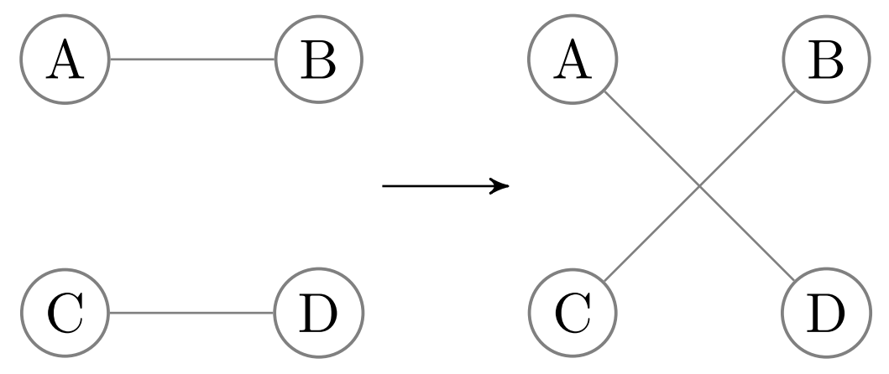
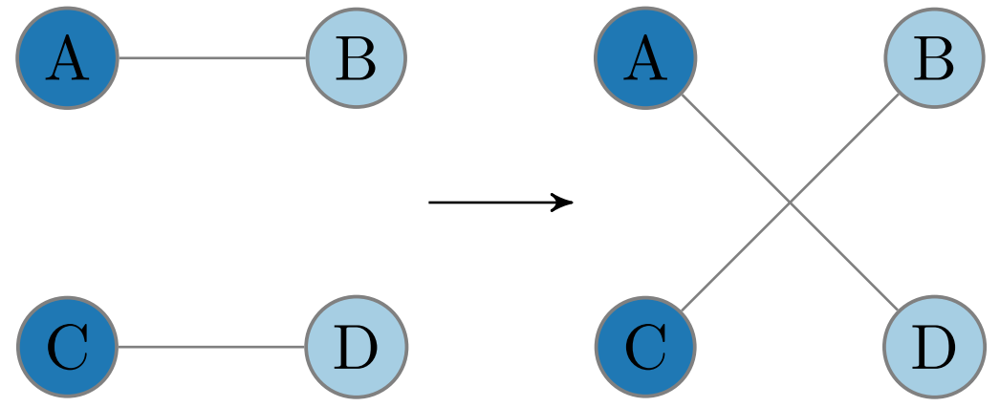
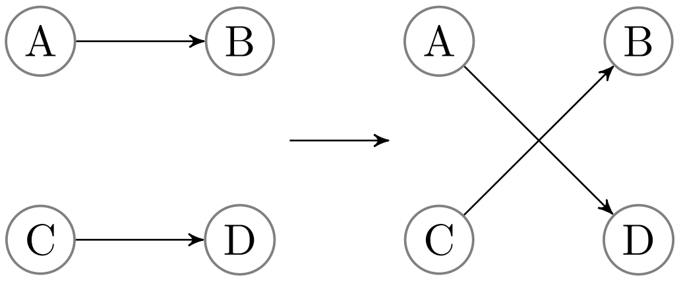

## Introduction

Networks contain information about relationships between entities ("edges between nodes").
A node's degree is the number of relationships it has in the network.
Networks contain many nodes, whose degrees can be aggregated to form the network's degree distribution.
Because different nodes can have very different degrees, real networks have highly variable degree distributions (Figure {@fig:hetionet}).

![Degree distribution can vary greatly between networks, even between the source and target degree distributions within the same (directed or bipartite) network.
  Shown are seven degree distributions for six edge type subnetworks of Hetionet [@doi:10.7554/eLife.26726].
  (The final two are the source and target distributions of the gene-regulates-gene directed edge type.)
](https://github.com/greenelab/xswap-analysis/raw/5a257c9d28e0a4c3cc8f2fd8493f27ff4652f2c6/img/hetionet_degrees.png){#fig:hetionet width="100%"}

Degree is an important metric for differentiating between nodes, and it appears in many common edge prediction features [@doi:10.1155/2015/172879].
However, reliance on degree can pose problems for edge prediction.
Firstly, bias in the data can distort node degree so that degree differences between two nodes may not be meaningful.
Secondly, reliance on degree can lead edge prediction methods to make nonspecific or trivial predictions and fail to identify novel or insightful relationships.

Most biomedical data networks are imperfect representations of the true set of relationships.
Real networks often mistakenly include edges that do not exist and exclude edges that do exist.
How well a network represents the true relationships it attempts to represent depends on a number of factors, especially the methods used to generate the data in the network [@doi:10.1016/j.jprot.2014.01.020; @doi:10.3389/fgene.2015.00260; @doi:10.1038/nbt1116].
We define "degree bias" as the type of misrepresentation that occurs when the fraction of incorrectly existent/nonexistent relationships depends on the number of connections that nodes make (their "degrees").
Depending on the type of data being represented, degree biases can arise due to experimental methods, inspection bias, or other factors [@doi:10.1016/j.jprot.2014.01.020].

Inspection bias indicates that entities are not uniformly studied [@doi:10.1038/nature04209], and it is likely to cause degree bias when networks are constructed using hypothesis-driven findings extracted from the literature, as newly-discovered relationships are not randomly sampled from the set of all true relationships.
For example, the number of publications mentioning a gene has little correlation with its degree in a systematically-derived protein interaction network [Figure 6A in @doi:10.1016/j.cell.2014.10.050].
Therefore, the high correlation between number of publications and degree in low-throughput interaction networks is almost entirely the result of inspection bias.
This evidence suggests that many poorly studied genes have similar numbers of interactions as the genes scientists have preferentially examined.
The consequence of degree bias is that a difference in degree between two nodes may not reflect a difference in the number of true edges.
Reliance on degree may be unfavorable depending on the prediction/analysis task being conducted and the magnitude of possible degree bias in the data.

Another reason why a method's reliance on degree can be unfavorable is that degree imbalance can lead to prediction nonspecificity.
Nonspecific predictions are made on the basis of generic characteristics rather than the specific connectivity information contained in a network.
For example, Gillis et al. [@doi:10.1371/journal.pone.0017258] examined the concept of prediction specificity in the context of gene function prediction and found that many predictions appear to rely primarily on multifunctionality and could be "potentially misleading with respect to causality."
Real networks have a variety of degree distributions (Figure {@fig:hetionet}), and they commonly exhibit degree imbalance [@doi:10.1371/journal.pone.0017645; @doi:10.1007/978-1-61779-361-5_13; @doi:10.1038/s41467-019-08746-5].
Degree imbalance leads high-degree nodes to dominate in the predictions made by degree-associated methods [@doi:10.1093/bioinformatics/btv215], which are effective predictors of connections in some biological networks [@doi:10.1186/1752-0509-2-11].

Consequently, degree-based predictions are more likely nonspecific, meaning the same set of predictions performs well for different tasks.
However, depending on the prediction task, edge predictions between very high degree nodes may be undesired, uninsightful, or nonspecific.
Model evaluation is challenging in this context, as nonspecific or trivial predictions need not be incorrect, even if they are not the desired outputs of the predictive model.
For example, predicting that the highest degree node in a network shares edges with the remaining nodes to which it is not connected will often lead to many correct predictions, despite the predictions being generic to all nodes in the network.
Degree-based features should often be included in the interpretation of predictions to disentangle desired from non-desired effects and to effectively evaluate and compare predictive models.

Degree is important in edge prediction, but it can cause undesired effects.
We sought to understand the effect of node degree on edge prediction methods.
We introduce a permutation-based framework to find edge existence probabilities due to node degree and to quantify the contribution of degree to edge prediction methods.
This method allows edge predictions to be evaluated in the context of degree and its effects on the prediction task.
Our results demonstrate that degree-associated methods are very effective for reconstructing a network using a subsampled holdout but ineffective for predicting edges between distinct degree distributions.
Using a number of different networks, we provide evidence that degree has a strong effect on the probability of edge existence and that our "edge prior" feature best quantifies this probability.

## Methods

### Network permutation

Network permutation is a way to produce new networks by randomizing the connections of an existing network.
Specialized permutation strategies can be devised that randomize some aspects of networks while retaining other features.
Comparing between permuted and unpermuted networks gives insight to the effects of the retained network features.
For example, an edge prediction method that has superior reconstruction performance on a network compared to its permutations likely relies on information that is eliminated by permutation.
Conversely, identical predictive performance on true and permuted networks indicates that a method relies on information that is preserved during permutation.
Network permutation is a flexible framework for analyzing other methods, because it generates networks with identical formats to the original network.
We propose using network permutation to isolate degree and determine its effects in different contexts.
Degree-preserving network permutation obscures true connections and higher-order connectivity information while retaining node degree, and thereby, the network's degree sequence.
Thanks to the flexibility of permutation, our framework can quantify the effect of degree on any network edge prediction method.

### XSwap algorithm

Hanhijärvi, et al. presented XSwap [@doi:10.1137/1.9781611972795.67], an algorithm for the randomization ("permutation") of unweighted networks (Figure {@fig:algo}A).
The algorithm picks two existing edges at random, and if the edges constitute a valid swap, exchanges the targets between the edges (Figure {@tbl:xswap}).
This process is repeated many times until the maximum number of steps has been reached.
In general, the maximum number of steps should be chosen to be sufficiently large that the fraction of original edges retained in the permuted network is near its asymptotic value for a large number of steps.

To allow greater flexibility, we modified the algorithm by adding two parameters, "`allow_loops`", and "`allow_antiparallel`" that allow a greater variety of network types to be permuted (Figure {@fig:algo}B).
Specifically, two chosen edges constitute a valid swap if they preserve degree for all four involved nodes and do not violate the above condition options.
The motivation for these generalizations is to make the permutation method applicable both to directed and undirected graphs, as well as to networks with different types of nodes, variously called multipartite, heterogeneous, or multimodal networks.

When permuting bipartite networks, our method ensures that each nodes class membership and with-class degree is preserved.
Similarly, heterogeneous networks should be permuted by considering each edge type as a separate network.
This way, each node retains its within-edge-type degree for all edge types.
We provide documentation for parameter choices depending on the type of network being permuted in the GitHub repository (https://github.com/hetio/xswap).
The original algorithm and our proposed modification are given in Figure {@fig:algo}.

![
  **A.** XSwap algorithm due to Hanhijärvi, et al. [@doi:10.1137/1.9781611972795.67].
  **B.** Proposed modification to XSwap algorithm](images/xswap_algorithms_combined_labels.png){#fig:algo width="85%"}

| Network type | Degree preserved | Figure | `allow_antiparallel` | `allow_loops` |
| :----------- | :--------------- | :----- | :------------------- | :----------------- |
| simple | all | {height="85px"} | False | False |
| bipartite | in/out | {height="85px"} | True | True |
| directed | in/out | {height="85px"} | ? | ? |

Table: Applications of the modified XSwap algorithm to various network types with appropriate parameter choices.
For simple networks, each node's degree is preserved. For bipartite networks, each node's number of connections to the other part is preserved, and overall node class memberships are preserved. For directed networks, each nodes' in- and out-degrees are preserved, though parameter choices depend on the network being permuted. Some directed networks can include antiparallel edges or loops while others do not. {#tbl:xswap}

### Edge prior

We introduce the "edge prior" to quantify the probability that two nodes are connected based only on their degree.
The edge prior can be estimated using the fraction of permuted networks in which a given edge exists---the maximum likelihood estimate for the binomial distribution success probability.
Based only on permuted networks, the edge prior does not contain any information about the true edges in the (unpermuted) network.
The edge prior is a numerical feature that can be computed for every pair of nodes that could potentially share an edge, and we compared its ability to predict edges in three tasks, discussed below.

### Edge prior analytical approximation

We also considered the possibility that the probability of an edge existing across permuted networks could be written as a closed form equation involving the node pair's degree.
A major simplification is the assumption that the probability of an edge existing is independent of all other potential edges.
We were unable to find a closed-form solution giving the edge prior without assuming independence in this way, which we believe is incorrect for XSwap.
Nonetheless, we discovered a good analytical approximation to the edge prior for networks with many nodes and relatively low edge density.

Let $m$ be the total number of edges in the network, and $d(u_i)$, $d(v_j)$ be the source and target degrees of a node pair, respectively.
A good approximation of the edge prior is given by the following:
\begin{equation}
    P_{i,j} = \frac{d(u_i) d(v_j)}{\sqrt{(d(u_i) d(v_j))^2 + (m - d(u_i) - d(v_j) + 1)^2}}
\end{equation}

Further discussion of this approximate edge prior and an derivation are available in [the supplement](#approx-prior-supp).

### Prediction tasks

We performed three prediction tasks to assess the performance of the edge prior.
We compared the permutation-based prior with two additional features: a scaled product of source and target degree (scaled to the range [0, 1]) and our approximation of the edge prior.
We used 20 biomedical networks from the Hetionet heterogeneous network [@doi:10.7554/eLife.26726] that had at least 2000 edges for the first two tasks.
In the first task, we computed the degree-based prediction features (edge prior, scaled degree product, and prior approximation), and predicted the original edges in the network.
We used node pairs that lacked edge in the original network as negative examples and those with an edge as positive examples.
To assess the methods' predictive performances, we computed the area under the receiver operating characteristic curve for all three features.
In the second task, we sampled 70% of edges from each of the networks, computed features on the sampled network, then attempted to predict held-out edges.
For this task, negative examples were node pairs in which an edge did not exist in either original or sampled network, while positive samples were those node pairs without an edge in the sampled network but with an edge in the original network.

The third task evaluated the ability of the edge prior to generalize to new degree distributions.
We used two domains where networks were available which shared nodes but had different degree distributions.
Protein-protein interactions (PPI) and transcription factor-target gene (TF-TG) relationships had networks created by literature curation of low-throughput, hypothesis-driven research and by high-throughput, systematic, hypothesis-free experimentation.
For the PPI networks, we used the STRING network, which incorporates literature-mining to find relationships [@doi:10.1093/nar/gky1131] and a combination of the high-throughput, proteome-scale interaction networks from Rual et al. [@doi:10.1038/nature04209] and Rolland et al. [@doi:10.1016/j.cell.2014.10.050].
We used a transcription factor-target gene (TF-TG) literature-derived network from Han et al. [@doi:10.1093/nar/gkx1013] and a high-throughput network from Lachmann et al. [@doi:10.1093/bioinformatics/btq466].
The pairs of networks for PPI and TF-TG data sources are ideal because in one we expect inspection bias and in the other we do not.

As a further basis of comparison, we added a time-resolved co-authorship network, which we partitioned by time to create two separate networks.
We created the co-authorship network of bioRxiv preprints using the Rxivist [@doi:10.1101/515643; @doi:10.5281/zenodo.2566421] database, which was generated by crawling the bioRxiv server.
Unlike the other two, the co-authorship network does not have degree bias, as the network faithfully represents all true co-author relationships.
We include this network to offer a comparative prediction task in which the degree distributions between training (posted before 2018) and testing (posted during or after 2018) do not differ (Figure {@fig:degree-bias}A).
The goal of the third prediction task is to determine feature generalizability for network reconstruction between different degree distributions, especially predicting a network without degree bias using features from a degree-biased network.
Further information about the networks used can be found in [the supplement](#networks).

### Degree-grouping

Our method for degree-preserving permutation produces randomized networks that share few of their edges with the original network.
The feature values for two node pairs with the same source and target degree are drawn from the same distribution in permuted networks, so nodes with equal degree can be grouped when summarizing features.
We used this to augment each node pair's feature values in permuted networks, which allowed these pairs to have more permuted feature values than permuted networks.
Degree grouping greatly increased the effective number of permutations for nodes with frequently observed degrees [@url:https://github.com/greenelab/hetmech/pull/96].
We used degree grouping throughout our analyses.

### Implementation and source code

We implemented the modified XSwap algorithm as a Python package, with the actual edge swap mechanism implemented in C++ for greater speed.
In addition to functions that permute networks (represented as edge lists), the package contains utilities for computing the edge prior, converting a network between adjacency matrix and edge list formats, and for assigning unique identifiers to nodes.
The Python package is available on the Python Packaging Index under the name "xswap".
The full source code for our method of degree-preserving network permutation has also been made freely available ([https://github.com/hetio/xswap](https://github.com/hetio/xswap)), as has the code for the analysis, figure generation ([https://github.com/greenelab/xswap-analysis](https://github.com/greenelab/xswap-analysis)), and manuscript ([https://github.com/greenelab/xswap-manuscript](https://github.com/greenelab/xswap-manuscript)).

## Results

### Node degree bias

We found examples of node degree bias in the PPI and TF-TG networks we investigated.
Figure {@fig:degree-bias} shows node degree in separate networks for the same type of data.
For the PPI networks, the literature-derived network has a larger mean degree and a longer tail than the systematic network, while in the TF-TG networks this relationship is reversed.
Because the TF-TG network contained far more transcription factors than target genes (144 and 1406, respectively), the distributions of target degrees were far more compact than those of source degrees.
Unlike the PPI and TF-TG networks, the co-authorship networks, which were split by date of first co-authorship, did not exhibit a great difference in their degree distributions.
All three types of networks (PPI, TF-TG, and co-authorship) exhibit degree imbalance to varying extents.
These results indicate that, depending on the methods by which the represented data were generated, networks of the same type of data may have overall degree distributions that differ greatly (Figure {@fig:degree-bias}A), and they may even assign very different degree to the same nodes (Figure {@fig:degree-bias}B).

A prediction task that uses only one type of network is challenging because degree distributions vary greatly within a single domain.
Predicting systematic edges using a literature-curated network is particularly challenging, because the degree distribution of systematic edges may be skewed toward higher or lower degree relative to the literature network.

![**A.** Degree distributions of networks with and without degree bias can be very different.
  Data on PPI and TF-TG were split between literature-derived and systematically-derived networks.
  In both cases, the networks exhibit large differences in degree distribution.
  Co-authorship relationship networks split by date of first co-authorship roughly share their degree distributions.
  **B.** Systematically-derived networks are not uniformly sampled sampled from literature-derived networks or vice versa.
  Uniform random sampling produces linearly-correlated node degree, while non-random sampling produces non-correlated degree.
  70% of literature edges were sampled with uniform probability for the "Subsampled holdout" network.
](https://github.com/greenelab/xswap-analysis/raw/d7181e64a5c90f9720ab453334892aba164651e7/img/degree_bias.png){#fig:degree-bias width="100%"}

### Edge prior

In the first prediction task, we computed three features---the XSwap edge prior, an approximation to the edge prior, and the (scaled) product of source and target node degree---on networks from Hetionet.
We then evaluated the extent to which these features could reconstruct the 20 networks.
The XSwap-derived edge prior reconstructed many of the networks with a high level of performance, as measured by the AUROC.
Of the 20 individual networks we extracted from Hetionet, 17 had an edge prior self-reconstruction AUROC >= 0.95, with the highest reconstruction AUROC at 0.9971 (Compound–downregulates–Gene edge type).
Meanwhile, the lowest self-reconstruction performance (AUROC = 0.7697, Disease–localizes–Anatomy edge type) occurred in the network having the fewest node pairs.

{#fig:discrimination width="60%"}

The three features that we compared were highly rank correlated (median > 0.99999 across metaedges).
The three features also had very similar AUROC reconstruction performance values for the first, second, and third prediction tasks (max difference < 0.027) because AUROC is rank-based.
The edge prior was slightly better than the approximations in 12 of 20 networks.
However, while the AUROC results were similar, the features were very different in their levels of calibration---the ability of the model to correctly estimate class membership probabilities.
We found that the edge prior was very well calibrated for all networks in the first and second tasks, and it provided the best calibration of the three features for each of the prediction tasks (Figure {@fig:calibration}A).
As the edge prior was not based on the networks' true edges, these results indicated that degree sequence alone was highly informative and that permutation was the only approach that provided a well-calibrated model.

![**A.** Calibration curves for full network reconstruction of 20 networks from Hetionet.
  The permutation-based edge prior's calibration was superior to the other two strategies based on degree.
  **B.** Calibration curves for sampled network reconstruction.
  The edge prior shows superior calibration in the 20 Hetionet networks.
  **C.** Individual Hetionet edge type calibration estimated by the two-component decomposition of the Brier score, in which lower scores indicate better calibration.
  The edge prior has excellent calibration in unsampled and sampled networks, and each considered method is sensitive to shifts in the degree distribution.
](https://github.com/zietzm/xswap-analysis/raw/c763473ee83c6157f2430bf9a64b19dc564b7dbc/img/fig4.calibration.png){#fig:calibration width="100%"}

The second prediction task mirrored the first task, but it involved reconstructing networks based on subsampled networks with only 70% of the original edges.
Because edges were sampled uniformly without replacement, the subsampled networks share similar degree distributions to the original networks (see Figure {@fig:degree-bias}B).
Unlike in the first task, edges that were present in the sampled network were not tested and therefore are not included in the performance metrics.
The results of the second prediction task further demonstrate a high level of performance for degree-sequence-based node pair features (Figure {@fig:discrimination}).
The edge prior was able to reconstruct the unsampled network with an AUROC of greater than 0.9 in 14 of 20 networks.
As was observed in the first task, node pair features computed in second prediction task were highly rank-correlated, meaning the AUROC values for different features were similar.
While performance was slightly lower in the second task than the first, we found that many networks were still well reconstructed.
The edge prior was the best calibrated feature for both tasks.

In the third prediction task, we computed the three edge prediction features for paired networks representing data from PPI, TF-TG, and bioRxiv bioinformatics pre-print co-authorship.
The goal of the task was to compare predictive performance across different degree distributions for the same type of data.
We find that the task of predicting systematically-derived edges using a network with degree bias is significantly more challenging than network reconstruction, and we find consistently lower performance compared to the other tasks (Figure {@fig:discrimination}).
The edge prior was not able to predict the separate PPI network better than by random guessing (AUROC of roughly 0.5).
Only slightly better was its performance in predicting the separate TF-TG network, at an AUROC of 0.59.
We find superior performance in predicting the co-authorship relationships (AUROC 0.75), which was expected as the network being predicted shared roughly the same degree distribution as the network on which the edge prior was computed.
The results of the third prediction task show that a difference in degree distribution between the network on which features are computed and the network to be predicted can make prediction significantly more challenging.

Since the edge prior is based only on degree, it is unsurprising that it exhibits weak performance in predicting a network with a different degree distribution.
We have considered the edge prior as a baseline edge predictor, whose performance indicates the utility of degree for a specific prediction task.
The edge prior's low performance in the third task indicates that degree is less helpful for edge prediction tasks in which training and testing networks do not share their degree distributions.
Moreover, we believe such between-distribution prediction may be a relatively common task, with examples given by the networks in Figure {@fig:degree-bias}.

## Discussion

### Prediction performance and the edge prior

We focus on edge prediction in biomedical networks.
Our overall goal is to predict new edges with specificity, so that predictions reflect particular connectivity rather than generic node characteristics.
Our permutation framework is designed to capture the predictive performance attributable to degree to provide a baseline expectation for edge pairs.
We expect that degree-based non-specificity is not a unique property of biomedical networks.
For example, if node A connects to nearly all other nodes in a network, predicting that all remaining nodes share an edge with node A will likely result in many correct--though nonspecific--predictions, regardless of the type of data contained in the network.
Node degree should be accounted for to make correct predictions while being able to distinguish specific from nonspecific predictions.

Prediction without reliance on node degree is challenging because many effective methods for edge prediction are correlated with degree (eg Figure {@fig:feature-degree}).
The effects of node degree are obvious when edge prediction features are functions of degree.
For example, the resource allocation index is the sum of inverse degree of common neighbors between source and target nodes (in the symmetric case), while preferential attachment is the product of source and target degree [@doi:10.1140/epjb/e2009-00335-8; @doi:10.1145/1065385.1065415].
However, because many other edge prediction methods are not explicitly degree-based, it is important to have a general method for comparing the effects of node degree on edge prediction methods.

We developed a permutation framework to quantify the edge probability due to degree.
We term this probability the "edge prior", and we have identified two applications.
First, a probability associated with every node pair can be treated as a classification score.
Ordering these scores provides an assessment of performance based solely on degree, which can be used as a baseline for other classifiers.
Second, node pair probabilities can be used to adjust edge prediction features depending on the task.
If degree is a desired feature, then the edge prior can be treated like a Bayesian prior probability.
Alternatively, if degree is not a desired feature, then the edge prior can be used to calibrate features and thus potentially enhance predictive specificity.

## Conclusion
