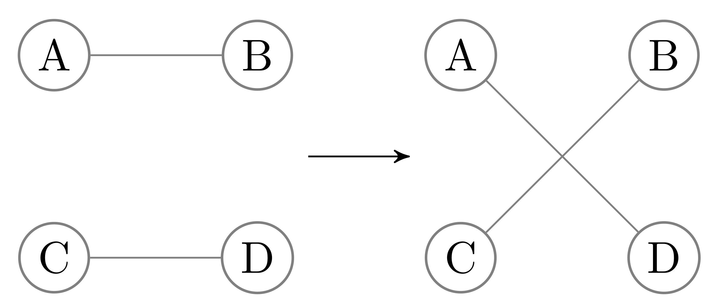

## Background

### Node degree bias

Networks of biomedical data often have node degrees that are biased with respect to the extent to which certain entities have been studied.
Compared to a hypothetical network of the true relationships, biomedical data networks have edges that are missing in a non-uniform way, where some nodes have a much higher fraction of their true edges while others have almost none of their true edges.
This particular kind of bias can occur when networks are constructed using data extracted from the literature.
As the extent to which a biomedical entity has been studied does not necessarily imply its number of true connections, less well-studied entities will have degrees that are biased toward being significantly lower than their true number of connections, when compared to better-studied entities.
This phenomenon of edges missing in a non-uniform manner is due to "inspection bias", in which certain entities or classes of entities are studied in greater detail than others [@doi:10.1038/nature04209].

Bias in the structure of networks can be demonstrated in domains where unbiased experimentation methods exist.
While systematic methods are not free of all bias, the bias introduced should be independent of degree.
If the biases of high-throughput experimentation are roughly degree-independent, then the degree distributions of networks produced via comprehensive, systematic experimentation resemble the degree distributions of true relationships.
When such unbiased data are available, the degree bias in literature-derived networks can be quantified by comparing degree between literature-derived and unbiased networks.

Figure {@fig:node-degree-bias} gives examples of degree distribution bias in five networks, two protein-protein interaction networks (one of which is literature-derived, and the other of which was constructed via a high-throughput screen of all human proteins), two transcription factor-target gene networks (one of which is literature-derived, and the other of which was constructed from a ChIP-seq screen), and a co-authorship network based on bioinformatics preprints posted on bioRxiv. 
Figure {@fig:sampling_vs_systematic} shows bias in individual node degree for the PPI and TF-TG networks. 
On the one hand, when edges are uniformly sampled there remains a linear correlation between degree in the networks. 
On the other hand, non-random sampling--as is done in low-throughput scientific experimentation--can introduce bias in both directions relative to systematic investigations.

![Degree distributions of biased and unbiased networks can be very different. Protein-protein interaction (PPI) literature-derived network from STRING (Szklarczyk et al.) [@doi:10.1093/nar/gky1131], high-throughput-derived networks from Rual et al. [@doi:10.1038/nature04209] and Rolland et al. [@doi:10.1016/j.cell.2014.10.050]. Transcription factor-target gene (TF-TG) literature-derived network from Han et al. [@doi:10.1093/nar/gkx1013] and high-throughput network from Lachmann et al. [@doi:10.1093/bioinformatics/btq466].  BioRxiv data from Rxivist [@doi:10.1101/515643; @doi:10.5281/zenodo.2566421].](https://github.com/greenelab/xswap-analysis/raw/bd40eb244ffe37454dc08099f5742ef3e962c70d/img/1_degree_bias/histogram.png){#fig:node-degree-bias width="100%}

{#fig:sampling_vs_systematic width="85%"}

Networks created through degree-unbiased experimentation have node degrees that are linearly correlated with the number of true relationships.
Many domains, however, do not have unbiased experimental methods, either because such methods have not yet been developed or because such methods are not possible, in principle.
For example, compound-disease treatment relationships in human patients can not be elucidated via large scale, unbiased experimentation.
Without unbiased data, the available networks on which analysis methods can be applied (the data themselves) have node degree bias of an unquantifyable magnitude.
It is therefore helpful to use methods that can quantify and correct for the effects of degree on the methods used for network analysis, inference, and prediction.

### Unsupervised link prediction

The application motivating the present work is (biomedical) network link prediction.
In particular, we restrict our attention to unsupervised prediction, meaning that there are no edges which are known but not already in the network.
Supervised network reconstruction tasks are useful for many methods, especially for evaluating and comparing prediction methods.
However, reconstruction tasks are inappropriate for training or evaluating prediction methods between networks with very different degree distributions.
Corrupted (or "sampled") networks share their degree distributions, roughly, with the uncorrupted networks (for example, see Supplemental figure {@fig:supp-dists}).
The issue remains, though, that the target networks (or the networks whose edges are the true goal of modelling and prediction) may have vastly different degree distributions compared to the networks available.
Because the degree distributions of networks can be highly biased when compared to the distribution of true relationships, it is imperative to take into account the differences between degree distribution when generalizing a trained supervised prediction method to new data.
If comprehensive and systematically-produced networks exist for a particular domain, link prediction is superfluous.
For many real domains, especially in biomedicine, such data do not or cannot exist.
This motivates the need for unsupervised methods that can prioritize potential relationships.
Ideally, such methods should be able to generalize between extreme differences in degree distribution.

### Feature-degree correlation

Network analysis methods are varied and can examine networks at many scales, including node, node-pair, community, and whole-network.
In this investigation, we restrict our attention to node-pair features used for purposes of link prediction, though the principles are also applicable to other types of network analyses.

Bias in a network's degree distribution can be toward either higher or lower degree (Figure {@fig:node-degree-bias}).
To make unbiased predictions, therefore, features used for prediction should not be strongly influenced by degree, either positively or negatively.
In practice, though, many features commonly used for link prediction are correlated with degree (Figure {@fig:features-degree}).

![Common link-prediction features are correlated with node degree. Shown are five features (Supplemental table 2) computed on literature-derived protein-protein interaction network [@doi:10.1093/nar/gky1131] and the geometric mean of the node pair's source and target degrees. All five features show a positive relationship with degree, though the magnitude of this correlation is highly variable. For example, preferential attachment and random walk with restart (RWR) appear to have stronger relationships with degree than the Jaccard index.](https://github.com/greenelab/xswap-analysis/raw/bd40eb244ffe37454dc08099f5742ef3e962c70d/img/2_link_prediction_feature_degree_correlation/without_prior.png){#fig:features-degree width="100%"}

Some link prediction features are functions of basic node pair properties like degree.
These features (Supplemental table 2) can allow the effect of node degree to be predicted or derived directly.
For example, the resource allocation index is the sum of inverse degree of common neighbors between source and target nodes (in the symmetric case), while preferential attachment is the product of source and target degree [@doi:10.1140/epjb/e2009-00335-8; @doi:10.1145/1065385.1065415].
Many features and link-prediction methods, however, cannot be interrogated to determine, _a priori_, the effect that node degree will have.
Therefore, it is important to have a more general method for comparing the relative effects of node degree on features and other link-prediction methods.

## Methods

### Network permutation

<!-- Need a discussion about what counterfactual would look like.
Wouldn't expect zero features in "null condition".
Should explain what the "null condition" should be, logically, and why
permutations capture that.

Also can't compare raw features between entities-->

The raw values of features computed for a given network entity depend both on relevant and non-relevant information, including extraneous and biased structural properties of the network.
While features may depend heavily on extraneous information, unsupervised applications seeking to order entities should rely as much as possible on the relevant information contained in the network.
To eliminate the bias due to network structure, we propose a comparison to the counterfactual condition in which a feature's value depends only on the potentially biasing network degree sequence.
This comparison allows a feature's true value to be given a corresponding "significance" score, which indicates how likely the feature would occur by chance given only degree sequence.
We term the empirical feature significance score the "corrected" feature, as it has been corrected for the contribution of degree to the raw feature.
The specifics of this comparison depend on the specific predictive or inference task being performed.
We use link prediction as an example application that illustrates several of the ways in which network permutation can be useful.

<!-- Because relative degree is not, in general, reflective of the relative true degree of an entity, and because degree is highly influential in many features used for link prediction, we believe that degree is a confounding variable in biomedical link prediction.
To eliminate these confounding effects, we propose comparing entities not by their raw feature values, but by features corrected for confounding structural information through the use of meaningful counterfactual distributions. 
To quantify the effects of degree on network-based methods, we propose a comparison between a network of actual data and degree-preserving permutations of the network.
By comparing a network-based feature-extraction method between the true network and its permutations, our method isolates the contribution of network degree sequence and thereby quantifies the effect of degree on predictive/analysis methods. -->

### XSwap algorithm

Hanhijärvi, et al. presented XSwap [@doi:10.1137/1.9781611972795.67], an algorithm for the randomization ("permutation") of unweighted networks (Figure {@fig:algo}A).
The algorithm picks two existing edges at random, and if the edges constitute a valid swap, exchanges the targets between the edges (Figure {@fig:xswap}).
To allow greater flexibility, we added two parameters, "`allow_self_loops`", and "`allow_antiparallel`" that allow a greater range of possibly valid swaps (Figure {@fig:algo}B).
Specifically, two chosen edges constitute a valid swap if they preserve degree for all four involved nodes and do not violate the above condition options.
The motivations for these generalizations are to make the permutation method applicable to both directed and undirected graphs, as well as between networks with different types of nodes, variously called multipartite, heterogeneous, or multimodal networks.
The original algorithm and our proposed modification are shown in Figure {@fig:algo}.

![**A.** XSwap algorithm due to Hanhijärvi, et al. [@doi:10.1137/1.9781611972795.67]. **B.** Proposed modification to XSwap algorithm](images/3_xswap_algorithm_pseudocode/algos-merged.png){#fig:algo width="100%"}

{#fig:xswap width="50%"}

### Unsupervised prediction task

To evaluate the effectiveness of network  permutation for unsupervised link prediction, we performed two comparisons: a network reconstruction task and the prediction of unbiased relationships using a biased network.
To create the sampled network, we randomly dropped 30% of each network's edges.
Because all edges are equally likely to have been dropped, this sampling method does not introduce new degree bias, and nodes in the resulting network have degrees that are linearly correlated with degrees in the source network (Supplemental figure {@fig:supp-dists}.
To predict the edges in a network without degree bias, we computed features on literature-curated networks that are subject to degree bias.
In each comparison, features were computed for all node pairs, but edge prediction was only carried out for node pairs that were not self-loops and for which an edge did not already exist in the network on which features were computed.
To compare features by their ability to predict edges in an unsupervised manner, we used ROC curves and their areas (AUROC).

### Data used for comparisons

We used three different types of biomedical information networks for comparison purposes-- a protein-protein interaction (PPI) network, a transcription factor-target gene (TF-TG) network, and a co-authorship network for papers on bioRxiv in the bioinformatics section.
For each of the three data sources--PPI, TF-TG, co-authorship--we had three networks, representing a degree-biased (or previous) network, a sampled version (in which a fraction of edges are dropped), and a systematic (or future) network, in which we do not expect degree bias.

For the PPI networks, we used the STRING network, which incorporates literature-mining to find relationships [@doi:10.1093/nar/gky1131] and a combination of the high-throughput, proteome-scale interaction networks due to Rual et al. [@doi:10.1038/nature04209] and Rolland et al. [@doi:10.1016/j.cell.2014.10.050].
The bioRxiv co-authorship network was created using the Rxivist [@doi:10.1101/515643; @doi:10.5281/zenodo.2566421] database that was generated by crawling the bioRxiv server.
Unlike the other two, the co-authorship network does not have degree bias, as the network faithfully represents all true co-author relationships.
We include this network to offer a comparative prediction task in which the degree distributions between training (papers before 2018) and testing (posted to bioRxiv during or after 2018) do not differ (Figure {@fig:node-degree-bias}).
Information about the number of nodes and edges in these networks is available in Supplemental table 1.

### Features

We used three previously-developed features for the unsupervised edge prediction task: random walk with restart (RWR), the Jaccard index, and an inference score developed for link prediction in directed graphs [@raw:inference]. 
RWR was implemented as defined in [@raw:rwr], with the steady-state distribution of node $i$ ($\mathbf{x}_i$) given as follows, where $c$ is the probability of a restart, $A$ is the normalized adjacency matrix, and $\mathbf{y}_i$ is a vector with zero at all entries except $i$, where it is equal to one:

$$\mathbf{x}_i = (1-c) \mathbf{A} \mathbf{x}_i + c \mathbf{y}_i$$

We utilized the graph Laplacian method [@raw:laplacian] to normalize the adjacency matrix in a way that ensures results are symmetric, meaning $x_{i,j} = x_{j,i}$.

The Jaccard index is the fraction of the intersection and union of neighbors for two nodes. Let $k(u)$ be the set of neighbor nodes for node $u$. Then the Jaccard index for nodes $u$ and $v$ is

$$J(u, v) = \frac{|k(u) \cap k(v)|}{|k(u) \cup k(v)|}$$

The inference score used for link prediction on the directed graphs was applied to the TF-TG network.
To compute this score, let $A(u)$ denote the set of vertices that node $u$ points to and $D(u)$ the set of nodes that point to $u$.

$$S_{INF}(u, v) = \frac{|A(u) \cap D(v)|}{|A(u)|} + \frac{|D(u) \cap D(v)|}{|D(u)|}$$

RWR and the Jaccard index are appropriate for link prediction in simple graphs like the bioRxiv co-authorship network and PPI, but they are not applicable for prediction in directed or bipartite graphs like the TF-TG network.
Their limitation in this sense is due to the fact that no nodes in separate classes of a bipartite graph share any neighbors, and RWR does not have a stationary distribution when walks must traverse two classes of nodes.

RWR, the Jaccard index, and the inference score were also computed on permutations of the true networks to generate two additional node-pair features, the mean feature value across permutations and the "corrected" feature.
The mean feature value across permutations can be interpreted as the expected feature value for a given node pair due only to the network's degree sequence, rather than to true connectivity.
For any of the features we compute, the "corrected" feature is the fraction of permutations on which a given node pair's feature value is greater than its value in the true network.
The corrected value can be interpreted as an empirical significance score for the node pair's feature value in the true network.
Considered in this way, the test's null hypothesis is that the network's connectivity is not informative.
An insignificant score indicates that the node pair's feature value could be due entirely to degree.

We introduce a further link prediction feature, termed the "edge prior", that is computed via network permutation.
This feature is estimated by the fraction of degree-preserving permutations in which a given edge exists.
The flexibility of our modified XSwap algorithm makes the edge prior computable on most types of networks, with the exception of multigraphs or weighted graphs.
The edge prior's predictive performance is also evaluated for the unsupervised prediction tasks.

### Degree-grouping

Our method for degree-preserving permutation switches almost all edges in the network.
Because only degree is preserved, nodes with equal degree can be grouped when summarizing features.
Each node pair's feature values in permuted networks can be augmented in this way to have more permuted feature values than permuted networks.
For nodes with a common degree, degree grouping can greatly increase the effective number of permutations, even though only a smaller number of permuted networks were generated.

### Implementation and source code

We implemented the modified XSwap algorithm as a Python library, with the actual edge swap mechanism implemented in C++ for greater speed.
The code for our method of degree-preserving network permutation has been made freely available ([https://github.com/greenelab/xswap](https://github.com/greenelab/xswap)), as has the code for the analysis, figure generation ([https://github.com/greenelab/xswap-analysis](https://github.com/greenelab/xswap-analysis)), and manuscript ([https://github.com/greenelab/xswap-manuscript](https://github.com/greenelab/xswap-manuscript)).

## Results

We computed link-prediction features for all node pairs in three types of biomedical networks--PPI, TF-TG, and bioinformatics preprint co-authorship.
For each of the PPI and TF-TG networks, there were three individual networks on which features were computed, a degree-biased network, a sampled version of the degree-biased network, in which a fraction of edges were dropped, and a systematic network, in which no degree bias is expected.
The co-authorship network was split between relationships that existed as of before 2018, those that exist as of present, and a sampled version of the relationships that existed as of before 2018.
Unlike the two experimental networks, the three co-authorship networks all have a similar degree distribution (Supplemental Figure {@fig:supp-dists}).
We include the comparison to illustrate a plausible situation in which the target network for link prediction has a similar degree distribution to the network available for computing features.

We computed RWR and the Jaccard index on the PPI and co-authorship networks and an inference score developed for link prediction in directed graphs [@raw:inference] on the TF-TG network.
We used our network permutation algorithm to generate 1000 degree-preserving permutations of each of these networks, and we computed the same set of features on each permutation.
By comparing features computed on the actual networks to the features computed on degree-preserving permutations of the networks, we were able to compute "corrected" features, which quantify the significance of the original features relative to their value attributable to degree.

The features computed across original and permuted networks were evaluated for their ability to predict edges in the corresponding test networks.
The train/test network pairings evaluated were as follows: sampled/biased, biased/systematic, and systematic/biased.
Since the goal of our method is not to maximize reconstruction performance but ability to generalize to networks with different degree distributions, we are particularly interested in feature performance for the biased/systematic prediction task.
The results of these comparisons are shown in Figure {@fig:ROC}.

{#fig:ROC width="100%"}

{#fig:AUROC width="100%"}

We find that the task of predicting systematically-derived edges using a network with degree bias is more challenging than network reconstruction.
That is, we find consistently lower performance in predicting systematically-derived edges than reconstructing the original network (Figures {@fig:ROC}, {@fig:AUROC}).

We find noticable differences between the relative performances of raw, permutation-derived, and corrected features between directed and undirected networks.
In reconstructing undirected networks (bioRxiv and PPI), we find that raw features show the greatest performance, with raw RWR slightly outperforming the raw Jaccard index in both tasks.
For the systematic prediction task on these networks, however, we find that raw and corrected features show similar performance, though in both networks the corrected RWR is marginally superior.
The inference score does not show strong performance for predicting directed edges in the TF-TG network, especially for the systematic prediction task.
Still, it shows modest performance for the reconstruction task.

In general, the mean values of features across permuted networks show moderate performance.
In directed networks, these features outperform the edge prior.
Meanwhile, mean features underperform the prior in the directed network but outperform raw features.
The results indicate that mean features across permutations, in general, have performance between the edge prior and the raw/corrected features.

We are surprised to find that features derived exclusively from permutations showed competitive performance to raw link prediction features in some cases.
The edge prior shows superior performance for both tasks on the directed network.
Also surprisingly, the mean value of the inference score across permutations shows superior performance to the inference score itself.
This result is unexpected because permutations do not contain true information, meaning that the mean inference score across permutations is attributable solely to degree.

Overall, we found that corrected features equal or outperform raw features in predicting systematic edges, while raw features equal or outperform corrected features for network reconstruction.
We find that the edge prior is an effective feature for edge prediction, showing similar performance across directed and undirected networks within each prediction task.
Mean feature values across permutations exhibit performance generally between that of raw/corrected features and the edge prior.
Finally, we observe that correcting features using our permutation method causes features to becomes less correlated with degree (Figure {@fig:feature-vs-corrected}).

{#fig:feature-vs-corrected width="75%"}

<!-- Above figure but histograms of degrees for top, say, 1% of the values (ie top features or lowest p-value) -->

## Discussion

In this work we concern ourselves with the task of link prediction and the effects of node degree.
We find that many common link prediction methods are correlated with degree (Figure {@fig:features-degree}).
This result is unsurprising, as several link prediction features are computed as functions of degree (Supplemental table 2).
The correlation between degree and link prediction features raises an issue, however, when one considers the potential bias in node degree.
Previous work has shown that networks of biomedical data are biased toward well-studied entities [@doi:10.1038/nature04209].
No networks of biomedical data contain all the true relationships.
Within the networks that exist and exhibit the bias previously reported, well-studied entities have a disproportionate fraction of their true relationships represented in the network.
Meanwhile, poorly-characterized entities have a smaller fraction of their relationships represented in the network.
This can lead to a situation in which two entities have the same number of true relationships but have a large difference in the number of connections in the network, due to one of the two being better-studied than the other.
Unbiased methods seek to identify equally edges connected to well- and poorly-characterized nodes.

Entities can have a relatively lower or higher number of connections in literature-derived networks when compared to systematic evaluations.
We have two potential explanations for these relationships.
First, where the degree in a literature-derived network is higher (PPI in Figure {@fig:features-degree}), one can conclude that the experimental method has a lower recall than small-scale experimentation.
Previous work supports this conclusion for the protein-protein interaction network used as an example in the present work.
Huang and Bader [@doi:10.1093/bioinformatics/btn640] found that the Y2H method is subject to a high false negative rate.
This finding explains the relationship in the top right panel of Figure {@fig:sampling_vs_systematic}.
Moreover, this finding makes sense as low-throughput experimentation can offer a much higher resolution of an individual PPI, especially in an _in vivo_, tissue-specific, or otherwise context-dependent setting that cannot be captured by the Y2H.
In the second case, entities have lower degree in literature-derived networks.
In general, this indicates that low-throughput experimentation has, thus far, identified only a small fraction of the true relationships.

In either case, the difference in degree distributions between networks derived from low-throughput and systematic evaluations is reflective of a bias in the degree to which entities have been studied and the effectiveness of experimental methods.
Differences in degree between entities in a network with degree bias do not necessarily imply that the entities have a different number of true relationships.
Moreover, since the features used for many applications--specifically link prediction--are influenced by degree, it is helpful to consider the counterfactual for prediction where systematic evaluation methods are unfeasible or do not exist.

We propose the use of empirical significance scores to "correct" features for the contribution of extraneous or biasing structural information.
Our proposed score is the fraction of permutations on which a more extreme feature value is observed compared to the true network.
These scores can be interpreted as the probability that an observed feature will occur due exclusively to the degree sequence of the network.
Low values of this score indicate that the feature is much higher than would be expected due only to the network's degree structure.
With degree contribution removed, the corrected features are attributable to information like community structure and true relationships, both of which are eliminated in network permutation.

We also introduce the edge prior, a permutation-derived node-pair feature that shows promise for link-prediction.
The edge prior is the fraction of permutations in which a particular edge appears.
Because it is based only on degree-preserving permutations of a network, the edge prior is attributable solely to the degree structure of a network.
We find that the edge prior is a predictive feature for certain tasks, performing better than a feature specificially-designed for predicting directed edges in the transcription factor-target gene network (Figure {@fig:ROC}).
This result validates the fact that degree is highly predictive for some tasks, despite the biases to which it may be subject.

While the finding that the edge prior is helpful for many tasks validates our network permutation method as a helpful method for analysis, a limitation of our method remains in that, for some of the prediction tasks, neither features nor corrected features were highly predictive.
Moreover, for supervised link prediction applications, we do not expect corrected features to be, in general, superior or sufficiently superior to warrant their use.
The utility of degree-preserving randomization and corrected features is in unsupervised network prediction and analysis tasks where the data available have a degree bias.
Moreover, networks in any domain where relationship data are not generated through unbiased means will be subject, to some extent, to degree bias.

The method we present is applicable to many types of networks, generalizing easily to bipartite, multipartite (or "heterogeneous"), or directed networks.
Permutations are especially useful for unsupervised edge prediction and node pair prioritization in heterogeneous networks.
To permute a heterogeneous network, each edge type can be permuted separately as if it were an independent bipartite network.
Such a procedure would ensure that degree is preserved for each node on a node-type basis as well.
In heterogeneous networks, features can be computed on a path-type (or "metapath") basis, meaning that unrelated  degree biases could be included in every feature.
Because an entire network can be permuted, our method allows the generation of a counterfactual distribution for heterogeneous networks in precisely the same fashion as for simple networks.
Finally, though features are computed for node pairs in the example of link prediction we present, the empirical significance method can be generalized to node, community, or network-level features as well.

## Conclusion

Inspection bias is manifest in many networks of biomedical data.
Well-studied entities can have many more relationships than poorly-studied entities that may have an equal number of relationships.
Moreover, while degree can be highly biased in networks, many link prediction methods are highly correlated with degree.
This motivates a method to account and correct for degree's effect on features and predictions.
We propose the use of degree-preserving network permutation to estimate feature values (on a node pair level) attributable entirely to degree.
Additionally, we propose an empirical significance scoring method to evaluate the likelihood that a feature value could arise entirely due to degree.
Adjusting for degree in the way we propose generates "corrected" features that are no longer linearly-correlated with degree but are as- or more effective in prioritizing systematically-derived edges.
Finally, we introduce a broadly-applicable, permutation-based link prediction feature that we term the, "edge prior".
This feature shows excellent performance for graph reconstruction and outperforms a specifically-created feature in predicting edges in a directed network.
Our results highlight the strong effect that degree has on link prediction, visualizes examples of the biases to which degree can be subject, and proposes a permutation-based framework for quantifying and correcting for the effect of node degree.
